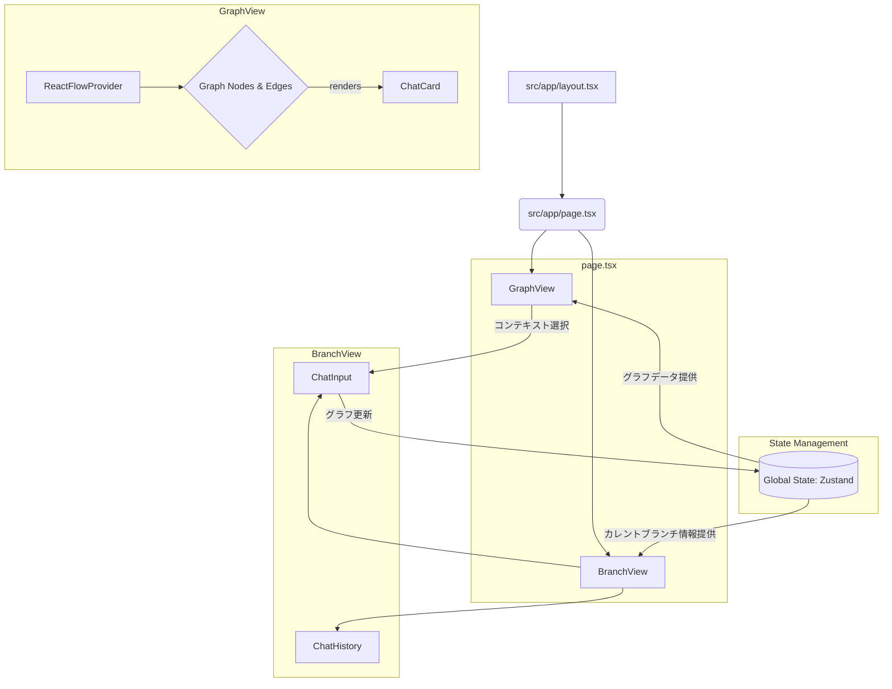

# GraphVerse アーキテクチャ設計書

## 1. 概要

本ドキュメントは、"GraphVerse"アプリケーションの技術アーキテクチャを定義するものです。

### 1.1. コンセプト

GraphVerseは、LLMとの対話をマインドマップのように視覚的に拡張していくWebアプリケーションです。従来の直線的なチャットUIとは異なり、ユーザーは対話の文脈（コンテキスト）を自由に選択し、思考の分岐や結合をグラフ構造として表現できます。

**ターゲットユーザー**: 主に研究者や学生など、1つのトピックに対して広さと深さのある探究を行いたいユーザー
**使用シーン**: 既存チャットAIの「深く探究したい」ユースケースを置き換え、情報の素早い取得よりも議論や探究に特化
**コア価値**: グラフ構造での会話の派生・merge機能により、複雑で多角的な議論やアイデア創出を支援

### 1.2. 主要機能

-   **GraphView**:
    -   ユーザーとLLMの対話履歴全体をグラフとして可視化します。
    -   各対話は「ノード」としてカードUIで要約表示されます。
    -   対話間の関連性は「エッジ」として線で結ばれ、思考の流れを一望できます。
    -   複数の独立したトピック（部分グラフ）を1つのセッション内で管理できます。
-   **BranchView**:
    -   現在フォーカスしている一連の対話（ブランチ）の詳細を時系列順で表示します。
    -   新しい対話を入力するインターフェースを提供します。
    -   複数のノードを同時にコンテキストとして選択可能です。
-   **MergeView（新機能）**:
    -   GraphViewから任意のノードを選択して新しい対話のコンテキストとして設定します。
    -   単一ブランチからの派生と、複数ノードからのmergeを統一的に処理します。
    -   コンテキストを選択しない場合は新しいトピックを開始します。

## 2. 技術スタック

本プロジェクトでは、モダンなWeb開発で広く採用され、生産性と開発者体験のバランスが取れた以下の技術を選定しました。

-   **フレームワーク**: Next.js (App Router)
-   **言語**: TypeScript
-   **UIライブラリ**: React
-   **ランタイム / パッケージマネージャ**: bun
-   **CSS**: Tailwind CSS
-   **リンター**: ESLint

## 3. ディレクトリ構成

Next.jsのApp Routerの規約に沿った、メンテナンス性と拡張性の高いディレクトリ構成を採用します。

```
.
├── .next/         # Next.jsのビルド成果物
├── node_modules/  # 依存パッケージ
├── public/        # 静的ファイル (画像など)
├── src/
│   ├── app/             # App Routerのルートディレクトリ
│   │   ├── api/         # API Routes (バックエンドロジック)
│   │   │   └── chat/
│   │   │       └── route.ts
│   │   ├── favicon.ico
│   │   ├── globals.css
│   │   ├── layout.tsx   # ルートレイアウト
│   │   └── page.tsx     # メインページ
│   ├── components/      # 再利用可能なUIコンポーネント
│   │   ├── ui/          # Shadcn/uiなどの汎用UIキット
│   │   ├── graph/       # GraphView関連コンポーネント
│   │   │   ├── GraphView.tsx
│   │   │   └── ChatCard.tsx
│   │   └── branch/      # BranchView関連コンポーネント
│   │       ├── BranchView.tsx
│   │       └── ChatInput.tsx
│   ├── hooks/           # カスタムフック
│   │   └── useGraphStore.ts
│   ├── lib/             # ユーティリティ、ヘルパー関数
│   │   └── utils.ts
│   ├── store/           # 状態管理 (Zustand)
│   │   └── index.ts
│   └── types/           # 型定義
│       └── index.ts
├── .eslintrc.json
├── bun.lockb
├── next.config.mjs
├── package.json
├── postcss.config.mjs
├── tailwind.config.ts
└── tsconfig.json
```

## 4. コンポーネントアーキテクチャ

コンポーネントは機能ごとに分割し、関心の分離を図ります。主要なコンポーネントとその関係性は以下の通りです。



-   **`page.tsx`**: アプリケーションのメインページ。`GraphView`と`BranchView`をレイアウトします。
-   **`GraphView.tsx`**: グラフ全体を描画するコンテナコンポーネント。グラフ操作（ズーム、パン）のロジックも担当します。
-   **`ChatCard.tsx`**: `GraphView`内の個々のノード（チャット要約）を表すコンポーネント。
-   **`BranchView.tsx`**: 現在のブランチのチャット履歴と入力フォームを持つコンテナコンポーネント。
-   **`ChatInput.tsx`**: テキスト入力、送信、コンテキスト選択のUIとロジックを担当します。

## 5. 状態管理

アプリケーションの状態は、その性質に応じてクライアント状態とサーバー状態に分類して管理します。

-   **クライアント状態**:
    -   グラフの構造（ノード、エッジ）、UIの状態（選択中のノードなど）は、アプリケーション全体で共有されるため、グローバルな状態管理が必要です。
    -   **採用ライブラリ**: **Zustand**
    -   **理由**: Context APIに比べてボイラープレートが少なく、シンプルで直感的なAPIを提供します。パフォーマンスにも優れています。

-   **サーバー状態 (キャッシュ管理)**:
    -   サーバーとのデータ通信（APIからのグラフデータ取得など）は、キャッシュ、再検証、楽観的更新といった高度な制御が必要です。
    -   **採用ライブラリ**: **SWR** または **React Query (@tanstack/react-query)**
    -   **理由**: データフェッチングに関する複雑なロジックをカプセル化し、宣言的に記述できます。Next.jsとの親和性も高いです。

## 6. データモデルと機能仕様

TypeScriptを用いてデータの型安全性を確保します。主要なデータモデルと機能仕様は以下の通りです。

### 6.1. グラフの分岐・Merge機能

**分岐（Branch）の動作**:
- 単一ブランチの末端/途中からの派生: そのブランチ全体を継承し、自動でエッジが作成される
- 複数ノードのcherry pick: Mergeとして扱う

**Mergeの動作**:
- 専用UIでGraphViewから欲しいノードをハイライト選択
- 新しいノードが作成され、選択したノードからエッジが接続
- コンテキストを0個選択 = 新トピック開始

### 6.2. コンテキスト管理

**LLMコンテキスト制限対応**:
- ユーザーがコンテキスト選択時に文字数制限を表示
- 1個ずつ選択して制限内に収める方式
- 選択したノードの全文をLLMに送信

### 6.3. セッション管理

**セッションの粒度**:
- 1セッション = 1トピック程度の粒度
- 複数の独立した部分グラフを1セッション内で管理
- セッション間の移動はリスト形式で履歴表示

**将来の拡張性**:
- 検索機能を考慮したデータ構造設計
- 重複検知機能のためのメタデータ保持

```typescript:src/types/index.ts
// グラフのノード (各チャットを表す)
export interface ChatNode {
  id: string; // 一意なID (例: 'node-1')
  type: 'chat'; // ノードの種類 (react-flowで使用)
  position: { x: number; y: number }; // GraphView上の座標
  data: {
    label: string; // ChatCardに表示する要約テキスト
    author: 'user' | 'llm';
    fullText: string; // チャットの全文
    timestamp: Date;
    isSelectedAsContext: boolean; // コンテキストとして選択されているか
    tokenCount: number; // コンテキスト制限管理用
    topics: string[]; // 将来の検索機能用
    branchInfo?: {
      parentNodeIds: string[]; // このノードの親ノード(コンテキスト元)
      branchType: 'single' | 'merge' | 'new_topic'; // 分岐の種類
    };
  };
}

// グラフのエッジ (ノード間の接続を表す)
export interface ChatEdge {
  id: string; // 一意なID (例: 'edge-1-2')
  source: string; // 接続元ノードのID
  target: string; // 接続先ノードのID
  // 必要に応じて重みなどのプロパティを追加
  // weight?: number;
}

// セッション管理
export interface ChatSession {
  id: string;
  title: string;
  createdAt: Date;
  updatedAt: Date;
  nodes: ChatNode[];
  edges: ChatEdge[];
}

// コンテキスト管理
export interface ContextState {
  selectedNodeIds: string[];
  estimatedTokenCount: number;
  maxTokenLimit: number;
  canAddMore: boolean;
}

// グラフ全体の状態
export interface GraphState {
  currentSession: ChatSession;
  sessions: ChatSession[];
  contextState: ContextState;
  // アクションを定義
  addNode: (node: ChatNode) => void;
  addEdge: (edge: ChatEdge) => void;
  selectContext: (nodeIds: string[]) => void;
  createNewSession: (title: string) => void;
  switchSession: (sessionId: string) => void;
}
```

## 7. API設計

Next.jsのAPI Routesを用いて、バックエンドAPIを構築します。

### 7.1. チャットAPI

-   **エンドポイント**: `POST /api/chat`
-   **リクエストボディ**:
    ```json
    {
      "prompt": "新しいプロンプトのテキスト",
      "contextNodeIds": ["node-1", "node-3"],
      "sessionId": "session-123",
      "branchType": "single" | "merge" | "new_topic"
    }
    ```
-   **レスポンス (ストリーミング)**:
    -   LLMからの応答をリアルタイムにクライアントに送信するため、ストリーミング形式を採用します。
    -   成功時: 新しく生成された`ChatNode`と、それにつながる`ChatEdge`の情報を返します。
    -   失敗時: エラー情報を返します。

### 7.2. セッション管理API

-   **エンドポイント**: `GET /api/sessions` - セッション一覧取得
-   **エンドポイント**: `POST /api/sessions` - 新しいセッション作成
-   **エンドポイント**: `GET /api/sessions/[id]` - 特定セッションのデータ取得

### 7.3. コンテキスト管理API

-   **エンドポイント**: `POST /api/context/validate`
-   **リクエストボディ**:
    ```json
    {
      "nodeIds": ["node-1", "node-2"],
      "additionalText": "新しいプロンプト"
    }
    ```
-   **レスポンス**:
    ```json
    {
      "totalTokens": 1500,
      "maxTokens": 128000,
      "canAddMore": true,
      "nodeTokenCounts": {
        "node-1": 800,
        "node-2": 500
      }
    }
    ```

## 8. ライブラリ選定

主要機能を実現するためのライブラリを選定します。

-   **グラフ描画**: **React Flow** (`reactflow`)
    -   **理由**: 高機能でカスタマイズ性が高く、ノードベースのUI構築に特化しています。インタラクティブなグラフを効率的に実装でき、ドキュメントも豊富です。
-   **UIコンポーネント**: **Shadcn/ui**
    -   **理由**: アクセシビリティが考慮された高品質なコンポーネントを、コピー＆ペーストでプロジェクトに導入できます。Tailwind CSSベースであるため、デザインの統一性とカスタマイズの容易さを両立できます。

## 9. 開発フロー

-   **セットアップ**: `bun install`
-   **開発サーバー起動**: `bun dev`
-   **ビルド**: `bun build`
-   **コード品質**: `bun run lint` を実行し、ESLintによる静的解析を行います。Prettierとの連携も設定し、コードフォーマットを自動化します。

## 10. MVP機能の優先順位

### フェーズ1 (コア機能)
1. 基本的なGraphViewとBranchViewの表示
2. 単一ブランチからの派生機能
3. コンテキスト選択とLLM連携
4. コンテキスト制限表示と管理

### フェーズ2 (拡張機能)
1. Merge機能の実装
2. 新トピック開始機能
3. セッション管理と履歴表示

### フェーズ3 (将来機能)
1. 検索機能
2. グラフの表示最適化
3. エクスポート機能 